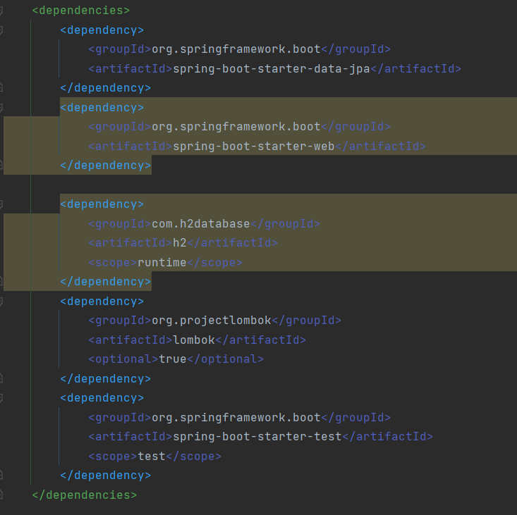
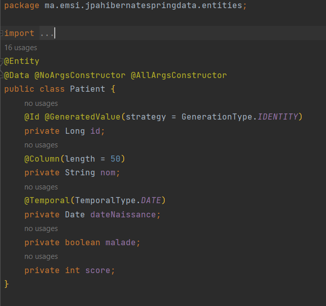
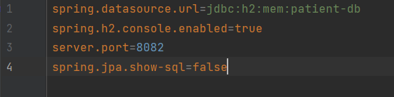
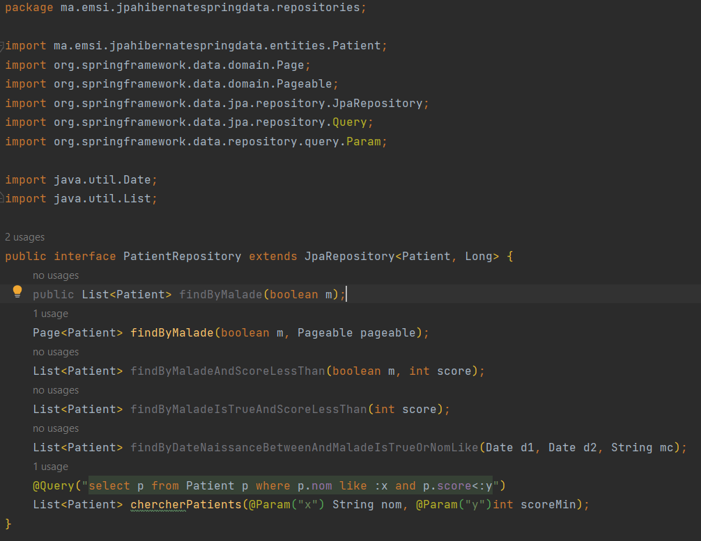
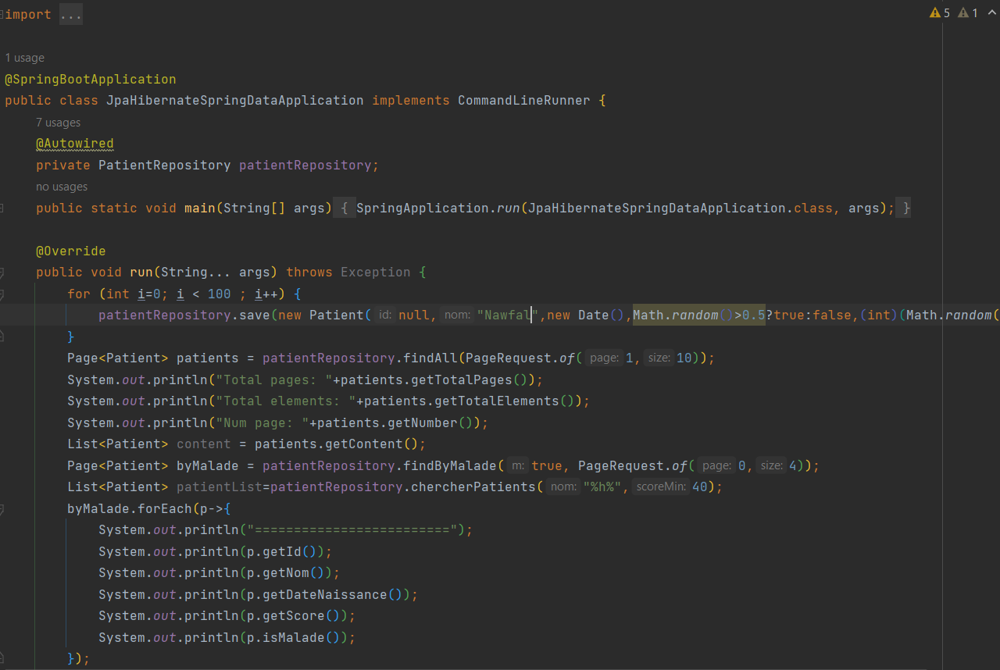
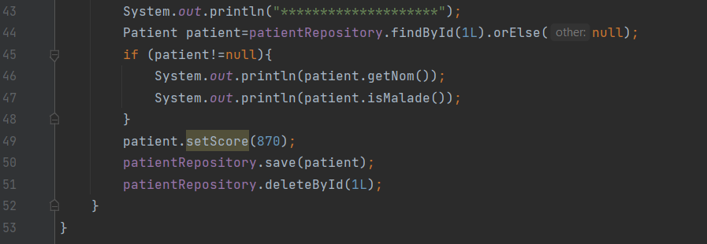

<h1>JPA Hibernate, Spring Data</h1>

<h3> 1. Création du projet Spring Initializer avec les dépendances JPA, Spring Web, H2 et Lombok</h3>

<h3> 2. Créayion de l'entité JPA Patient ayant les attributs : </h3>
<h6> - id de type Long   </h6>
<h6>- nom de type String  </h6>
<h6> - dateNaissanec de type Date  </h6>
<h6> - malade de type boolean  </h6>
<h6> - score de type int   </h6>
  

<h3> 3. Configuration de l'unité de persistance dans le ficher application.properties </h3>

<h3> 4. Créer l'interface JPA Repository basée sur Spring data</h3>

<h3> 5.  Tester quelques opérations de gestion de patients : </h3>
<h6>   - Ajouter des patients  </h6>
<h6> - Consulter tous les patients  </h6>
<h6> - Consulter un patient  </h6>
<h6> - Chercher des patients  </h6>
<h6> - Mettre à jour un patient   </h6>
<h6> - supprimer un patient   </h6>
  
  
